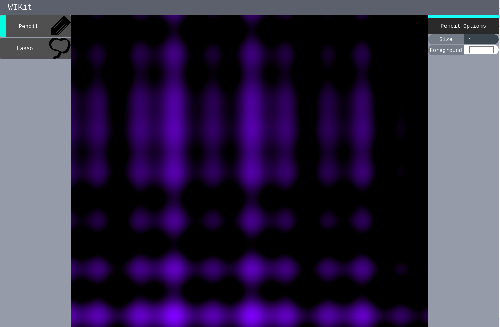

# WIKit

WebGL Image Kit

An image editor in the browser

Attempts to somewhat mimick GIMP, but with a fancy interface that makes you think some rando didn't make it

## Dependencies
- [twgl.js](https://github.com/greggman/twgl.js) -> minimal webgl wrapper (this one wasn't a pain to use!)
- [@roguecircuitry/htmless](https://github.com/roguecircuitry/htmless) -> JS DOM api wrapper (homebrew)
- [es-module-shims](https://github.com/guybedford/es-module-shims) -> use import maps without pain

## Build dependencies
- [babel.js](https://github.com/babel/babel) -> TypeScript compile step